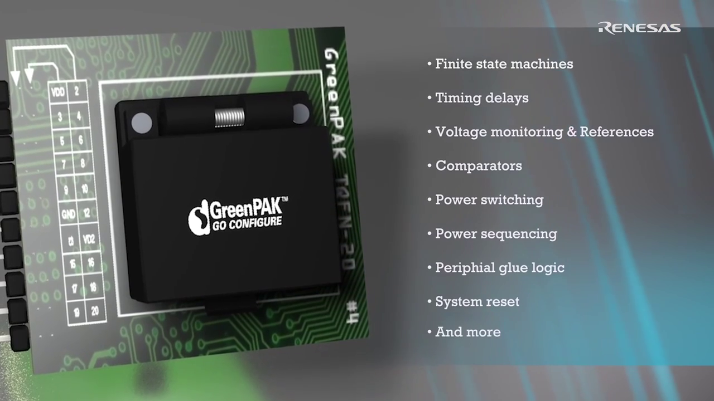
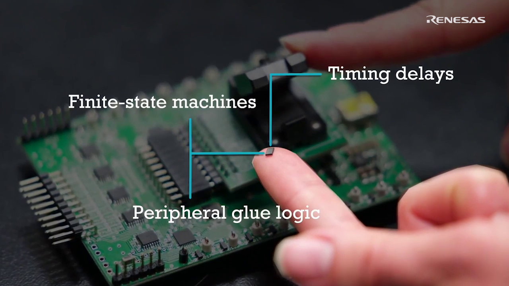
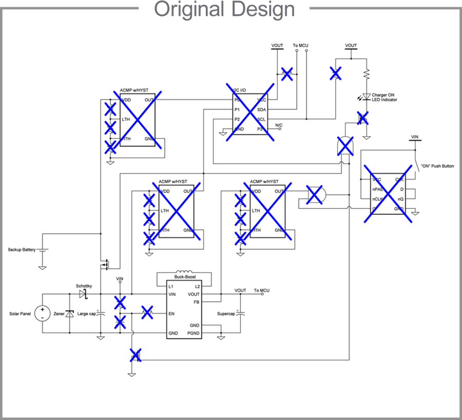
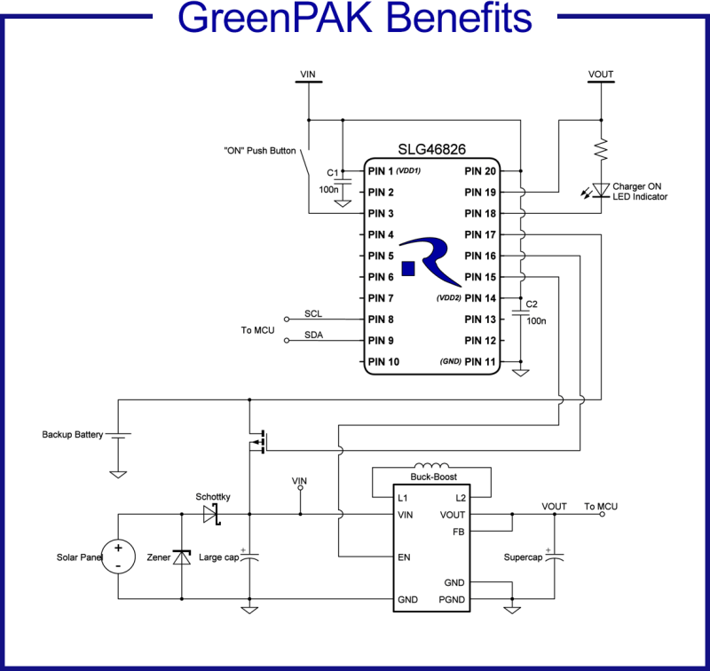

# GreenPAK Programmable Mixed-Signal
 

  
  
  

GreenPAK™ คือกลุ่มผลิตภัณฑ์ฮาร์ดแวร์จากบริษัท Renesas ซึ่งสามารถกำหนดค่าหน่วยความจำชนิด NVM ซึ่งราคาแข่งขันได้ ช่วยให้ผู้พฒนาสามารถผสานรวมฟังก์ชันระบบต่างๆ ไว้ในวงจรเดียว และลดจำนวนส่วนประกอบ พื้นที่บนบอร์ด PCB ได้ และใช้พลังงานลงได้ ด้วย GUI Go Configure Software Hub และ GreenPAK Development Kit ฟรี ผู้พฒนาสามารถสร้างและกำหนดค่าวงจรที่สมบูรณ์แบบได้ภายในไม่กี่นาที
 

  
  

